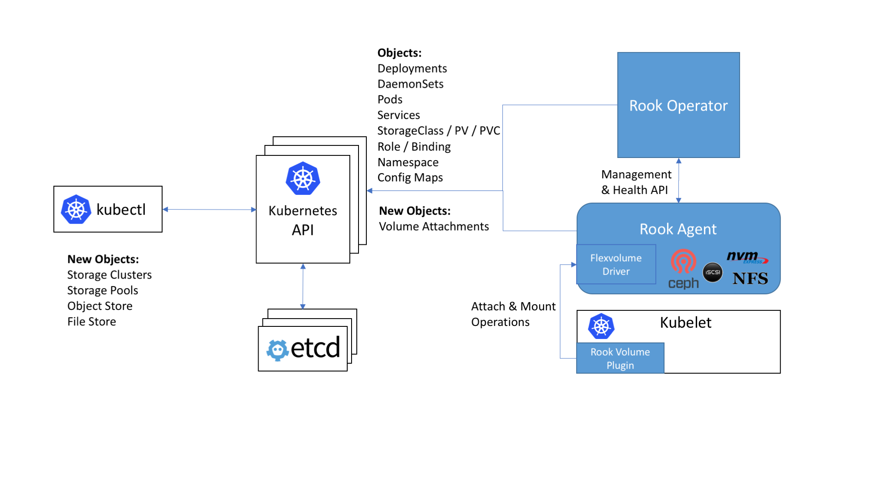

# Rook

Rook is an open source orchestrator for distributed storage systems running in Kubernetes.

Rook turns distributed storage software into a self-managing, self-scaling, and self-healing storage services. It does this by automating deployment, bootstrapping, configuration, provisioning, scaling, upgrading, migration, disaster recovery, monitoring, and resource management. Rook uses the facilities provided by the underlying cloud-native container management, scheduling and orchestration platform to perform its duties.

Rook integrates deeply into cloud native environments leveraging extension points and providing a seamless experience for scheduling, lifecycle management, resource management, security, monitoring, and user experience.

Rook is currently in alpha state and has focused initially on orchestrating Ceph on top of Kubernetes. Ceph is a distributed storage system that provides file, block and object storage and is deployed in large scale production clusters. Rook plans to add support for other storage systems beyond Ceph in future releases. 

## Getting Started

Starting Rook in your cluster is as simple as two `kubectl` commands. See our [Quickstart](quickstart.md) guide for the details on what you need to get going.

Once you have a Rook cluster running, walk through the guides for block, object, and file to start consuming the storage in your cluster:
- **[Block](block.md)**: Create block storage to be consumed by a pod
- **[Object](object.md)**: Create an object store that is accessible inside or outside the Kubernetes cluster
- **[Shared File System](filesystem.md)**: Create a file system to be shared across multiple pods

## Design

Rook enables storage software systems to run on Kubernetes using Kubernetes primitives. Although Rook's reference storage system is Ceph, support for other storage systems can be added. The following image illustrates how Rook integrates with Kubernetes:

With Rook running in the Kubernetes cluster, Kubernetes applications can
mount block devices and filesystems managed by Rook, or can use the S3/Swift API for object storage. The Rook operator
automates configuration of storage components and monitors the cluster to ensure the storage remains available
and healthy.

The Rook operator is a simple container that has all that is needed to bootstrap
and monitor the storage cluster. The operator will start and monitor [ceph monitor pods](https://github.com/rook/rook/blob/master/design/mon-health.md) and a daemonset for the OSDs, which provides basic
RADOS storage. The operator manages CRDs for pools, object stores (S3/Swift), and file systems by initializing the pods and other artifacts necessary to 
run the services.

The operator will monitor the storage daemons to ensure the cluster is healthy. Ceph mons will be started or failed over when necessary, and
other adjustments are made as the cluster grows or shrinks.  The operator will also watch for desired state changes
requested by the api service and apply the changes.

The Rook operator also creates the Rook agents. These agents are pods deployed on every Kubernetes node. Each agent configures a Flexvolume plugin that integrates with Kubernetes' volume controller framework. All storage operations required on the node are handled such as attaching network storage devices, mounting volumes, and formating the filesystem.

The Rook daemons (Mons, OSDs, MGR, RGW, and MDS) are compiled to a single binary `rook`, and included in a minimal container.
The `rook` container includes Ceph daemons and tools to manage and store all data -- there are no changes to the data path.
Rook does not attempt to maintain full fidelity with Ceph. Many of the Ceph concepts like placement groups and crush maps
are hidden so you don't have to worry about them. Instead Rook creates a much simplified UX for admins that is in terms
of physical resources, pools, volumes, filesystems, and buckets.

Rook is implemented in golang. Ceph is implemented in C++ where the data path is highly optimized. We believe
this combination offers the best of both worlds.

For more detailed design documentation, see the [design docs](https://github.com/rook/rook/tree/master/design).
